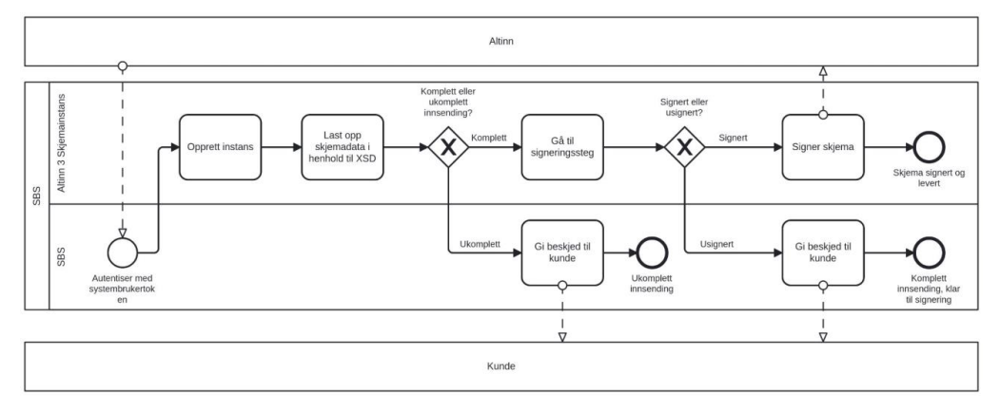

Dette er ment som dokumentasjon for utviklere hos sluttbrukersystemer som skal etablere innsending av årsregnskap i Altinn3.

## ID-Porten vs Systembruker
Systembruker er et nytt konsept i Altinn 3, som har som formål å delegere rettigheter til og
gjøre handlinger på vegne av en upersonlig bruker, som er definert av et samarbeid mellom
organisasjoner i stedet for en person. Man kan lese mer om det her.

Skjemaene for Årsregnskap støtter også bruk av systembruker til å fylle ut skjema på vegne
av en bedrift, men en viktig begrensning: Signatur krever fortsatt ID-Porten, så et
personnummer er tilknyttet signaturen. Dette er av juridisk hensyn.

|              | Instansiere på nytt dokument | Fylle inn verdier | Laste opp filer | Låse skjema | Signere |
|--------------|------------------------------|-------------------|-----------------|-------------|---------|
| **Systembruker** | ✅                            | ✅                 | ✅               | ✅           | ❌       |
| **ID-porten**    | ✅                            | ✅                 | ✅               | ✅           | ✅       |

Husk at å signere også automatisk sender inn skjema, så det er alltid siste steget i en
innsending.

Selve innsendingen er knyttet til bedriften i stedet for brukeren: Dette betyr at det er fullt
mulig å fylle ut et skjema med systembruker, deretter logge inn via ID-Porten for å signere
det samme dokumentet man fylte ut med systembruker.

## Ukomplett/Komplett/Signert innsending
Årsregnskap i Altinn3 støtter de samme 3 typer innsending som i Altinn2: Ukomplett
innsending, komplett innsending, og fullført. En innsending er fullført når den signeres. Den
vil da automatisk sendes til arkivet og innboksen

| Type                | Forklaring                                                                                                                  |
|---------------------|-----------------------------------------------------------------------------------------------------------------------------|
| Ukomplett innsending| Dokumentet er fylt inn med verdier, og kunde kan gå inn og redigere verdiene før de signerer.                               |
| Komplett innsending | Dokumentet er fylt inn med verdier, og låst. Kunde kan signere dokumentet, men kan ikke redigere verdiene.                  |
| Fullført/signert    | Regnskapsfører fyller inn verdier, og signerer dokumentet selv. Dokumentet blir sendt inn, og kunde får en kopi i innboksen |
 

Under er et BPMN-diagram for prosessen for å sette skjemaet i ønsket tilstand. Disse
handlingene gjøres via API-kall, eller ved å trykke på synlige knapper i skjemaet i
nettleseren.

Som vist på diagrammet, må skjemaet alltid gjennom alle tre tilstandene for å bli sendt inn.
Alle skjemaer starter som ukomplett innsending. Deretter må skjemaet låses (komplett
innsending) før det kan signeres.

## Bruk av API
Sammen med dette dokumentet er det lagt ved et sett med environments og collections
for Postman, som utviklerene av årsregnskapene har brukt til egentesting. Det er satt opp
for å kunne sende inn skjemaer til testserveren til altinn, tt02. Det er en nyttig ressurs for å
se hvordan man sender inn skjema.

Viktige konsepter:
* **Partyid:** En ID for et «party», altså en entitet som bruker altinn sine tjenester. Dette referer
til en bedrift eller en person. Om man logger seg inn som person med personnummer eller
bedrift med organisasjonsnummer, vil man bli tildelt et eget partyid-nummer. Det brukes
som et ledd i URLen i alle API-kall mot skjemaet. Man får det i respons fra første kall mot
APIet når man oppretter skjema. Det er også synlig i URL i nettleseren. 
* **Userid:** ID for en personbruker. Det finnes flere måter å hente ID-Porten token på, og
userid er det utviklerene for årsregnskap har brukt under utvikling. 
* **Altinn-access-token:** Når man har hentet et gyldig token for enten personbruker eller
systembruker fra henholdsvis maskinporten eller ID-Porten, må man veksle det inn til et
Altinn-token for at det skal fungerere mot APIet. Dette gjøres med et eget API-kall, som
finnes i Postman-oppsettet. 
* **Instance/InstanceId:** En instance er en spesifikk utfylling av et dokument. Det første man
gjør i innsending, er å opprette en ny, tom, instanse av regnskapet man skal sende inn.
Hver instanse får tildelt en GUID kalt InstanceId. Dokumentet blir lagret i skyen, og så lenge
man har instans-iden kan man alltid gå tilbake til det spesifikke dokumentet. Alle API-kall
unntatt det første som oppretter instansen, har instanceId i URLen. 
* **Dataelement/dataId:** Et regnskapsskjema består av forskjellige dataelementer, som er
blokker med data med forskjellig format. Hovedskjema er et dataelement,
selskapsregnskap er et dataelement, og konsernregnskap er et annet dataelement.
Vedlegg og signatur er også dataelementer. Hvert dataelement har en GUID kalt data_id.
Det blir generert av serveren når det opprettes, og Iden sendes i respons til klienten. Det
brukes i URLen når man sender data til skjemaet. For eksempel, for å fylle inn
hovedskjema data, må man sende et PUT kall til hovedskjemaets data_id. 
* **Scopes:** Scopes tildeles i samarbeidsportalen. For å sende inn årsregnskap trengs bare to
scopes: altinn:instances.read og altinn:instances.write. Dette holder også for signering.

## Multipart innsending
Etter at dere har fått dreisen på stegvis innsending som er i Postman-oppsettet, som
forsiktig gjør innsendingen ett steg av gangen, kan man forenkle prosessen ved å
instansiere skjema og laste opp all skjemadata og vedlegg i ett API-kall. Dette gjøres ved en
multipart/form-data innsending som kombinerer kall for hovedskjema, underskjemaer og
vedlegg. Man vil fortsatt trenge å deretter sende egne kall for å låse skjemaet og for å
signere. Les om hvordan å bygge multipart innsending her:
https://docs.altinn.studio/api/apps/instances/#create-instance

## Liste over alle skjemanavn
- aarsregnskap-vanlig-202406 
- aarsregnskap-skade-202404 
- aarsregnskap-ideelle-202402 
- aarsregnskap-friv-202402 
- aarsregnskap-liv-202404 
- aarsregnskap-bank-202404 
- aarsregnskap-begr-202405 
- aarsregnskap-vpfo-202405 
- aarsregnskap-pensjon-202404 
- aarsregnskap-funk-202405

## Slack-kanal for hjelp
Link: https://digdir-samarbeid.slack.com/archives/C08HF9DEALT

